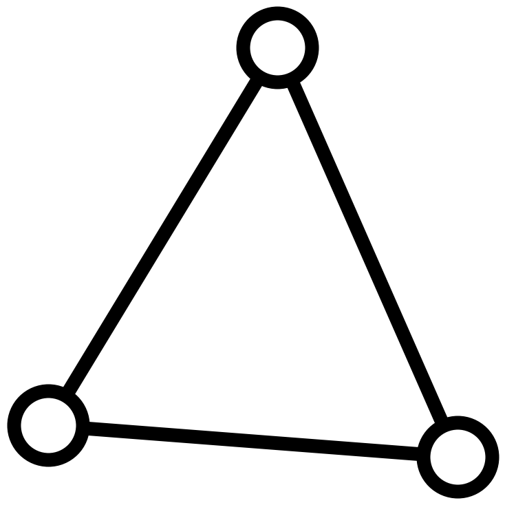
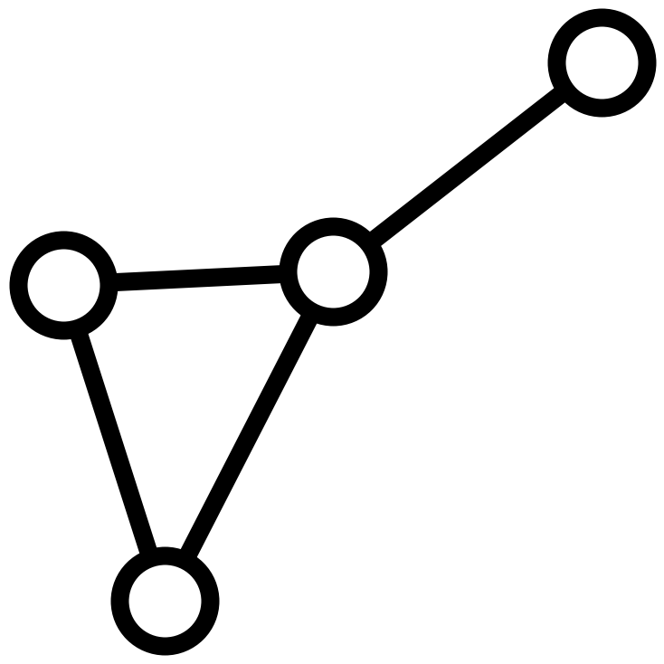
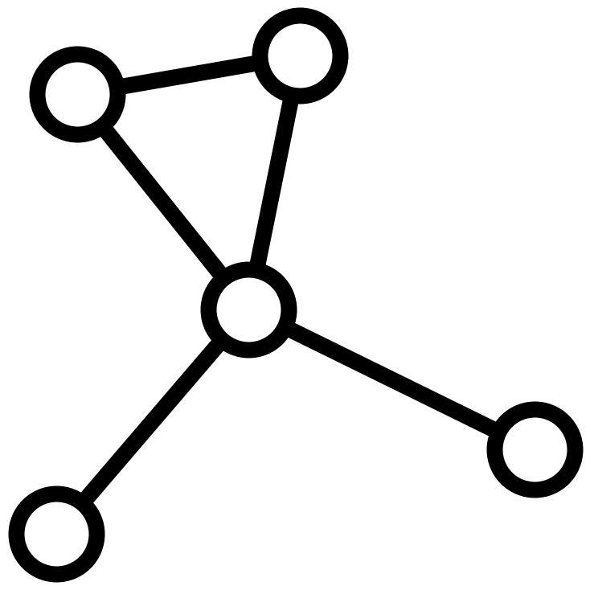

---
author:
  - Garrett J. Kepler
date: Updated 2.4.26
title: 'Lecture Notes on Combinatorics: Draft'
---

# Chapter 1: What is Combinatorics?

One great property of the field of combinatorics is most people have
already encountered combinatorial questions in their own life.

*Considering the optimal path we should take to get groceries and visit
the coffee shop then return home. Now that we have the groceries,
figuring out which set of dishes we can cook for the party when we've
invited a vegetarian, a non-vegetarian, and someone allergic to peanuts.
Now that we know what to cook, determining the best drinks paired with
which dishes.*

As simple of an example party planning is, we have described three
combinatorial problems already: minimal path, dish enumeration, and
drink/dish combinations.  
Many of the questions we ask in combinatorics focus on counting of some
sort.

- Enumeration: How many ways$\dots$?
- Existence: Does there exist$\dots$?
- Extremal: What is the largest/smallest possible$\dots$?
- Expectation: What is the expected number of$\dots$?

## Warmup

````{prf:question} Warmup
1. How many ways are there to assign 3 students 3 distinct Math 325 projects? 4 students 4 distinct projects? $n$ students $n$ distinct projects?
2. How many people must attend the first day of lecture in Math 325 to guarantee 2 people either both have met before or both have not met before?
3. How many people must attend the first day of lecture in Math 325 to guarantee 3 people either have all met before or have all not met before?
````

These preliminary warmup problems are classic combinatorial questions.
The first, a question of enumeration, we may have a straightforward way
to answer already:

> **Answer:**
> Well, we could assign student A project 1. Or, we could assign them
> project 2. Or, we could assign them project 3. That's 3 ways. Okay, for
> student B, we could assign project 1. Or, we could assign them project 2. Or, $\dots~\dots~\dots$ This is exhausting listing them out. I'm bored.

What we are going to learn in this class is methods to avoid this one by
one counting. Instead, we will "count". Rather than assigning a specific
student to a specific project one by one, we'll deal with the collection
of students and the collection of projects in their entirety:

> **Answer:**
> Given a student, we assign them 1 of the 3 projects. Since we want
> distinct assignments, the next student must be assigned one of the other
> 2 projects. Likewise, the final student must be assigned the leftover
> project. Using what we will later refer to as the *multiplication
> principle*, we have $3\cdot 2\cdot 1=6$ ways to do this.

The final two warmups ask questions of guaranteed substructures that we
will discuss later in the Ramsey Theory section.

# Problem Solving Basics & Set Theory

We will start with questions of *enumeration* and dedicate a fair amount
of time to this concept.

 ````{prf:definition} Enumeration
The problem of *enumeration* is to count the total number of objects with a specified property.
````

A few basic examples:

````{prf:example}
- How many ways are there to assign $n$ students to $m$ projects?
- How many distinct Sudoku puzzles are there?
- How many total (potentially isomorphic) graphs are there are on $n$
   nodes?
````

This questions can often be difficult to answer given a certain object
with a desired property. However, the philosophical approach we often
take is: **simplify**!

Our approach to these problems can be summarized in a joke told to me by
a faculty member at WSU:

<p align = center> <i>A mathematician walks into a room. In one corner, he sees an empty bucket. In another corner, he sees a sink. In 
another corner, he sees a fire. Scared, he picks up the
bucket, fills it at the sink, and puts out the fire.</i>

<i>The next day, the same mathematician returns to the same room. He sees a fire in the same corner. But, this time the bucket is full of water conveniently placed by the fire. So, he picks up the bucket, empties the water in the sink, places the bucket empty where it was from the day before and leaves. As he exits, he exclaims
victoriously \"I've reduced it to a previously solved problem!\"</i>

</p>

Our first goal will be to mimic this proverbial mathematician's
mentality: *simplify*! Once we've simplified, we'll ask ourselves: "can
we generalize this?"

## "I have reduced it to a previously solved problem!"

````{prf:question}
   :label: questions
Consider the following problems:
1. How many whole numbers are between 1 and 325 (including 1 and 325)?
2. How many whole numbers are between 28 and 352 (including 28 and 352)?
3. How many even numbers are there between 28 and 352 (including 28 and 352)?
4. How many numbers between 102 and 1074 are divisible by 3?
````

On the one hand, these are four distinct problems. On the other, you may
be able to see there is a process we can use to answer all of them. One
main approach we often utilize in combinatorics is the following: to
count what we need to count, reframe the problem as something we already
know how to count. To quote a great mathematician:

<p align = center>
    <i>"I have reduced it to a previously solved problem!"</i>
    </p>

Consider our first problem: "How many whole numbers are between 1 and
325 inclusive?"

> **Answer-ish:** 1 is our $1^{st}$, 2 is our $2^{nd}$, and so on, $325$ is our
> $325^{th}$. So, there must be $325$ such numbers.

This was so easy to solve! What we want to do now is use this solved
problem to answer another. Consider our second problem: "How many whole
numbers are between 28 and 352 inclusive?"

> ~~Answer-ish:~~ We begin counting: 28 is our $1^{st}$ number, 29 is our $2^{nd}$,
> and so on, so 352 must be our $?^{th}$.

What do we put here? No idea. We only know how to count numbers between
1 and 325. Let's instead transform this counting problem to the one we
know how to count:

> **Answer-ish:**
>
> 1. We may notice 28 is 27 away from 1. Likewise, 29 is 27 away from 2 and so on. So, take each number $28,29,30,\dots, 352$ and subtract 27: $1,2,3,\dots, 325$.
> 2. Amazing! We already know this answer: there are 325 such numbers.

One issue you may already have thought of: "how do I know there are the
same amount of numbers between 1 and 325 as 28 and 352 by simply
subtracting 27?" That is a great point. We don't yet know. However, this
is the beauty of a *bijection*. Something we'll talk about: if we have a
bijection between two sets, we know they are the same size. More on the
formalities later!

## "I have generalized the method to solve a previously unsolved problem!"

For now, consider the third problem: "How many numbers are there
between 28 and 352 inclusive that are divisible by 3?". Again, we don't know how to count this.
But, on the second problem, we transformed to the numbers
$1,2,3,\dots, 325$ and made our problem easier. Let's try something
similar:

> **Answer-ish:**
>
> 1. Take each number, $102,105,108,\dots,1071,1074$, and divide by $3$: $34,35,36,\dots, 357, 358$.
> 2. They may look different, but we can transform similarly to problem two.
> 3. Subtract 6 from each term and we get $28,29,30,\dots, 351, 352$. There are 325 such numbers, so there must be 325 such numbers divisible by 3 between 102 and 1074.

Now that we have a specific method of solution, we might reformat this
method to a more general problem. We may want to count the numbers
between $m$ and $n$ ($m<n$). Why not! Let's think:

- In our second and third problem, we took each number and found a way to obtain $\{1,2,3,\dots, n\}$ so that we could enumerate the solutions.
- If we want to take our $1^{st}$ number $m$ and send it the first natural number $1$, we might subtract $m-1$ (since $m-(m-1)=m-m+1=1$).
- For each of these numbers, we get $m-(m-1),m+1-(m-1), m+2-(m-1),\dots, n-1-(m-1), n-(m-1)$ which really is $1,2,3,\dots, n-m, n-m+1$. As such, we obtain a count of $n-m+1$ integers between $m$ and $n$ ($m<n$).

What's left to prove is that the process of subtracting $m-1$ here guarantees the two sets of numbers are
the same size. The next section will discuss how to use a *bijection* to do so.

## Set Theory Basics

This concept of bijection we subtly utilized previously is actually a
fundamental result combinatorialists love to exploit. Before we get
there, some basics are necessary.

 ````{prf:definition} Sets
 A *set* is a collection of distinct objects. E.g. The set of integers between 28 and 56 = $\{28,29,30,\dots, 56\}$, a set of graphs = {, , , } etc.
 ````

Note in our definition of a set we require *distinctness*. As such, the
collection $\{1,1,2,3,\dots,29\}$ is not a set. Likewise with any
collection with repeating elements, but this permits another important
definition:

 ````{prf:definition} Multisets
 A *multiset* is a collection of not necessarily distinct objects. E.g. The multiset of integers = $\{28,28,28,29,30,\dots, 56\}$, the multiset of graphs = {, , , , }, etc.
 ````

However, we won't touch multisets until later on. For now, let us
discuss relations between sets.

 ````{prf:definition} Function
 A *function* $f:A\to B$ is a relation between sets $A$ and $B$ such that for each $a\in A$ ($a$ in $A$), there is a unique $b\in B$ such that $f(a)=b$.
 ````

As an example, on the left, we have $g:A\to B$ that assigns the second
element in $A$ to two elements in $B$. This means $g$ a function. However, on the right, we have $f:A\to B$ that assigns each element in $A$ only one element in $B$. This means $f$ a function.

 ````{prf:definition} Injective, Surjective, Bijective
 Firstly, a function $f$ is *injective* if distinct elements in $A$ are mapped to distinct elements in $B$. Secondly, $f$ is *surjective* if every element in $B$ has at least one element in $A$ that gets mapped to it. Lastly, if $f$ is both injective and surjective, then $f$ is *bijective*.
 ````

For combinatorial purposes, one nice way to think of a function
$f:A\to B$ as the placement of a set of objects $A$ into a set of boxes
$B$:

- If no two objects are placed in the same box, $f$ is injective.
- If no box is left empty, $f$ is surjective.
- If both occur, $f$ is bijective.

We can use this thinking to phrase the following statements. Let $f:A\to B$ be a function that assigns a set of objects $A$ to be placed into a set of boxes $B$.
- $f$ is injective means $f$ ensures no two objects are placed in the
   same box.
- $f$ is surjective means $f$ leaves no box empty.
- $f$ is bijective means $f$ leaves no box empty and ensures no two
   objects are placed in the same box.

But, why do we care about this as combinatorialists?

````{prf:theorem} Injective, Surjective, Bijective (Again)
   :label: injsurjbij
Again, let $f:A\to B$ as defined above. Then,
1. If $f$ is injective, $|A|\leq |B|$
2. If $f$ is surjective, $|A|\geq |B|$
3. If $f$ is bijective, $|A|=|B|$
where $|\cdot|$ denotes the number of elements in a set.
````

First, an outline of a proof.

````{prf:proof}
Let $f$ be a function such that $f:A\to B$ for sets $A$ and $B$.\
1. If $f$ is injective, it ensures no two objects are in the same box.
   So, there must be at least enough boxes to house these distinctly
   assigned objects ($|A|\leq |B|$).
2. If $f$ is surjective, it leaves no box empty. So, there must be at
   least enough objects to fill each box ($|A|\geq |B|$).
3. If $f$ is bijective, it ensures no two objects are in the same box
   *and* no box is left empty. As such, we know $|A|\leq |B|$ *and*
   $|A|\geq |B|$ (i.e. that $|A|=|B|$).
````

This simple statement is incredibly powerful. What this theorem firstly tells us is that there is a way to infer information about the *sizes* of the sets when we have a specific property about the *relationship* between those sets. Most importantly, the theorem also states that if there exists a bijection between two sets, they must be the exact same size. We can exploit this fact to enumerate easily! In fact, we already have.  


Think back to our second problem: "how many integers are there between 28 and 352 inclusive?". Perhaps we write out "28 is $1^{st}$, 29 is $2^{nd}$, $\dots$" and so on until we reach 352 or count on our 325 fingers one by one. Either way we know this would be annoying and tedious to count explicitly. By defining a bijective function between sets, we eased the trouble, $f(a)=a-27$ for $a\in \{28,29,30,\dots, 325\}$.  

From this final "proof" in {prf:ref}`injsurjbij`, we can infer a lot of information. For clarity, if $f$ is bijective, each object has a distinct box *and* each box has a distinct object. If we wish to reverse the process of assignment $f$ has committed, we could easily do so: simply reverse each assignment! This thinking leads to the following theorem:

````{prf:theorem}
The function $f:A\to B$ is a bijection if and only if $f^{-1}$ exists.
````

This allows us to formalize our results:

- Let $A=\{28,29,\dots, 352\}$, $B=\{1,2,\dots, 325\}$, and $f:A\to B$
   be defined as $f(a)=a-27=b$ for $a\in A$ and $b\in B$.
- Since $f$ subtracts 27, $f^{-1}$ might add 27
   ($f(a)=a-27=b\implies a=f(a)+27\implies f^{-1}(b)=b+27$).
- Thus, $f$ must be a bijection since there exists an $f^{-1}$. So, we
   know $|A|=|B|$.
- Therefore, $|\{1,2,\dots, 325\}|=|\{28,29,\dots, 352\}|=325$.

We can use the same process with problems 3 and 4 of {prf:ref}`questions`:

- Let $A=\{28,30, 32,\dots, 352\}$ and define $f(a)=\frac{1}{2}a-13=b$
   for $a\in A$. What is $f^{-1}$? What is $B$? Conclude $|A|=|B|$.
- Let $A=\{30,33,36,\dots,348,351\}$ and define $f(a)=\frac{1}{3}a=b$
   for $a\in A$. What is $f^{-1}$? What is $B$? Conclude $|A|=|B|$.
- (Extra!) Let $A=\{m,m+1,m+2,\dots, n-1, n\}$ and define
   $f(a)=\frac{1}{k}a-\ell$ for $m<k<n$ and $\ell\geq 0$. What is
   $f^{-1}$? What is $B$? Conclude $|A|=|B|$.

## Summary

What we've done so far is introduce important techniques we often use in
combinatorics:

- Let's simplify our current problem to a problem we already know how
   to solve
- Now that we have found a method to solve a problem, let us
   generalize

These often guide thought in mathematical problem solving and we will
utilize both in combinatorics!

